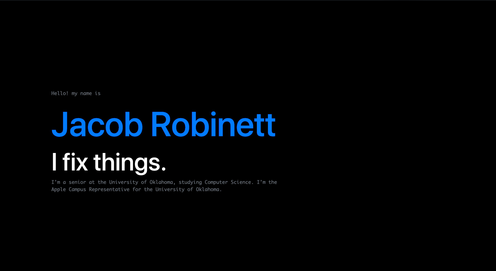

<h1 align="center">
  JacobRobinett.com - v1
</h1>

  The first official iteration of <a href="https://brittanychiang.com" target="_blank">JacobRobinett.com</a> built with BootStrap.

<!--

  Previous iterations:
  <a href="https://github.com/bchiang7/v1" target="_blank">v1</a>,
  <a href="https://github.com/bchiang7/v2" target="_blank">v2</a>,
  <a href="https://github.com/bchiang7/bchiang7.github.io" target="_blank">v3</a>

-->

  

 
