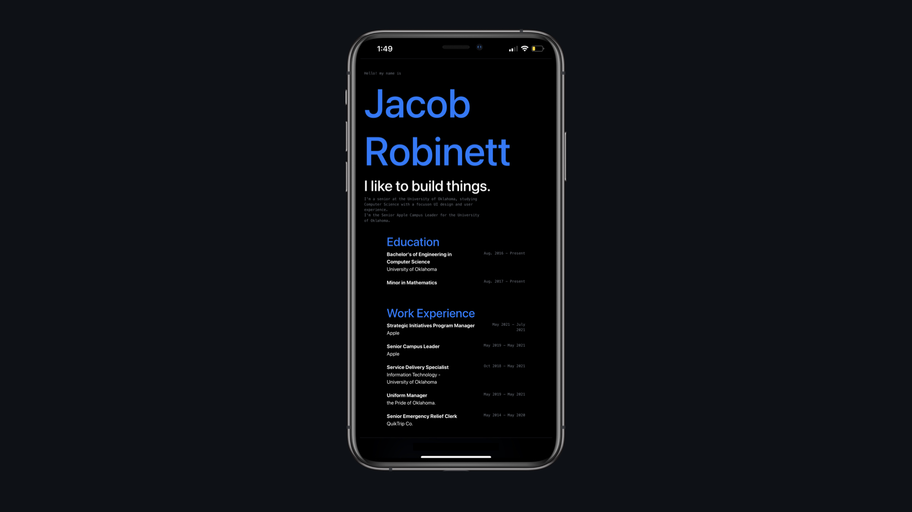

<h1 align="center">
  JacobRobinett.com
</h1>

  Second version of <a href="http://jacobrobinett.com" target="_blank">JacobRobinett.com</a> - A web based resume built with BootStrap.

 

  

> node index.js // runs index.html on port 8000
// add line to each endpoint to connect port 3000 to 8000
// index.html is displaying database > api > front end
// need to figure out how to deploy the api onto a server maybe netify??
// need to figure out how to deploy product page to port 8000

https://www.youtube.com/watch?v=hQAu0YEIF0g&ab_channel=OwenConti

https://www.seancdavis.com/posts/deploy-static-api-netlify/

https://www.youtube.com/watch?v=ACI8EDbaXzo
